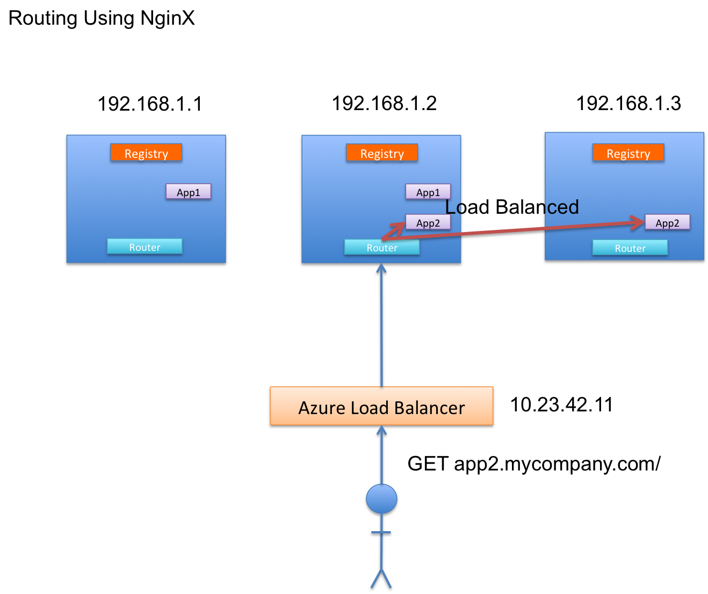

# Docker Fleet Starter

This is a package/guide on how to boot-strap your CoreOS backend with scalable Web microservices uses Fleet, and Etcd. We use a private portable docker registry which is backed by Azure Storage.

## Components

This Fleet Starter package has all the things you need to deploy and scale web applications and services using Docker and CoreOS. It includes 3 components:

- **Registry**: A portable private registry backed by [Azure Storage](), all apps and the **router** are deployed from here.
- **Router**: An Nginx Router which dynamically routes your web apps as you deploy them using [conf.d]() and [etc]()
- **Example App** An example [Node.js Express]() applciation which can be deployed

## How it Works

Fleet Starter uses the Azure Storage [storage adapter]() to build a [docker registry]() server which is portable. Because of this we can deploy a light-weight registry server and push and pull images by appending `localhost:5000` to our private image names. We provision a CoreOS cluster and deploy our private registry image from our single free private repository to each of our CoreOS nodes.

### Deployment


In the image above, we use our no-cost single docker repository to store the docker image of our docker registry server. The server is built with our Azure storage credentials and can be ran from anywhere with an internet conneciton.

This enables the architecture in the graphic above which allows us to deploy our registry as a fleet [global service](), which basically means one registry server runs on every server. This is because docker requires images in private repostiories be tagged with the name of their host. By hosting a light-weight registry server on each CoreOS instance we greatly simplify deploying images.

Once our registry service is deployed across the cluster with fleet, we can deploy any image within that registry as a service on the cluster. The graphic above depics the scenario of a developer, running a registry on their local machine and pushing the image to azure storage. The service is then restarted and the new image is deployed to the appropiate nodes.

Using an external image store allows us to run a private docker image repository without ever having to worry about SSL and authenticating users to our repository. We also get the advantage of the redundancy and backup features of Azure Storage.

### Service Discovery

CoreOS uses [etcd](), a demon service which is essentially a distributed key-value store which allows services to announce their presence by publishing keys with a TTL. Each deployed application instance is deployed with an accompanying 'announcer' service which is simply a bash script that periodically writes its host ip address and port number for it's cooresponding web server.


In the graphic above each **router** instance subscribes to etcd and it uses published keys in etcd to build its routing and load balancing rules. For example, **App1** exists on the first two VMs and between the two instances their cooresponding 'sidekick' services update the service directory key `App1` with the key-value pairs `@1: 192.168.1.1:3000` and `@2 192.168.1.2:3000`. Because the **nginx** router is subscribed to etcd it automatically rebuilds its routing temaplte. Requests going for **app1** will route to either of these two machines in a round-robin load balancing manner. The same goest for App2 - this design allows for any number of applications to be deployed in a load-balanced manner.

Fleet allows us to specifically define 'sidekick' services which are gauranteed to run on the same machine as the service it monitors. When the accompanying application service goes down so does the sidekick service. This keeps etcd up-to-date in the case of applciation updates and restarts.

Here's what the App1 [service file](example-app/example-app@.service) looks like:

```fleet
# example-app@.service
# the '@' in the file name denotes that this unit file is a model
Description=Example High-Availabilty Web App
After=router.service

[Service]
EnvironmentFile=/etc/environment
ExecStartPre=/usr/bin/docker pull localhost:5000/example-app:latest
ExecStart=/usr/bin/docker run --name example -p 3000:3000 localhost:5000/example-app:latest
ExecStop=/usr/bin/docker stop example
ExecStopPost=/usr/bin/docker kill example
ExecStopPost=/usr/bin/docker rm example

[X-Fleet]
Conflicts=example-app@*.service
```

This [Unit File](https://coreos.com/docs/launching-containers/launching/fleet-unit-files/) refers to the docker image `example-app` in our private azure docker registry. To start this unit we simply do:

```
# uplaod the service model to fleet
fleetctl submit example-app@.service
# start an instance of the service
fleetctl start example-app@1.service
```

The `X-Fleet Conflicts` tag in the unit file instructs `fleet` that we don't want more than one of this unit running on the same machine in order to have high availability.

### Routing & Load Balancing

The entire cluster sits behind a load balancer and has one public virtual IP address. This public IP address points to an Azure load balancer which serves requests to any of of our nodes.


When a user request comes in, because we have the **router** running and listening on port 80 and port 443 on each node we can handle the request no matter what node it comes to. Further, because of **etcd** service discovery each router has knowledge about where all the services are located and can route the request the appropiate container.



This means that the actual container which provides the service doesn't necessarily need to be on the machine that the Azure load balancer selects.


Furthermore, the Azure load balancer load balances requests amongst our router, but each **router** service unit load balances the containers for each service.
  
## Getting Started

This repository has everything you need to implement the architecture layed out above.

### Provisioning CoreOS

CoreOS, an operating system for distributed clusters will be required. [Fleet]() and [etcd]() services come preinstalled which is what this bootstrapper uses.

#### Azure

Using **Azure Resource Manager**:

Checkout the [Azure Resource Manager CoreOS MultiVM Template]() and be sure to use [this file](contrib/azure/cloud-config.yaml) for the CoreOS cloud-config.

Using the v1 **Service Manager**:

To deploy your CoreOS server on Azure using the legacy Service Manager issue the following commands:

```bash
# install python
brew install python
# install necessary python libraries
sudo pip install azure pyyaml
# generate the service management certificate
cd contrib/azure
# modify cert.config with your 
./generate-mgmt-cert.sh
# upload the generated azure-cert.cer file to your managment certificates via the azure portal
```

Create an affinity group if you already don’t have one via the azure portal [manage.windowsazure.com](http://manage.windowsazure.com). Supply it in quotes with the --affinity-group parameter. Although using an affinity group is not mandatory, it is highly recommended since it tells the Azure fabric to place all VMs in the cluster physically close to each other, reducing inter-node latency by a great deal. If you don’t want ot use affinity groups, specify a region for Azure to use with a --location parameter. The default is "West US". If you specify both parameters, location will be ignored. Please note that the script will not create an affinity group by itself; it expects the affinity group exists.

```bash
cd contrib/azure
./azure-coreos-cluster [cloud service name]
     --subscription [subscription id]
     --azure-cert azure-cert.pem
     --num-nodes [number of nodes, odd number]
     --affinity-group [affinity group name]
     --vm-size [VM Size, A3 and better recommended]
     --http
     --blob-container-url https://[blob container].blob.core.windows.net/vhds/
     --data-disk
     --custom-data cloud-config.yaml
```

This script takes a few minutes depending on how large of a cluster you are provisioning.

Now that your CoreOS cluster is installed you might want to either install [fleetctl](http://github.com/coreos/fleet) for your platform (supports osx and linux) or SSH into any one of your CoreOS nodes and use `fleetctl` there which comes installed.

Fleetctl is what allows you to deploy services across your entire cluster. We'll use it later in the guide.

### Starting the Private Docker Repo

We'll need to create a registry that fleet cna deploy our apps from. To do this we'll use the Azure Storage [adapter]() for the docker registry server in order to keep our image data in one central place.

Change the file [contrib/azure/config.yaml](contrib/azure/config.yaml) to contain your storage account name, key and the container you would like the registry to store images in. The container will be created by the registry server if it doesn't already exist.

```
azure:
   accountname: <<STORAGE_ACCOUNT_NAME>>
   accountkey: <<STORAGE_ACCOUNT_KEY>>
   container: <<DOCKER_IMAGE_CONTAINER>>
```

Copy thie file to [registry/distribtuion/cmd/registry/config.yaml](registry/distribtuion/cmd/registry/config.yaml) overriding the existing file.

Ensure you have an account at [hub.docker.com](http://hub.docker.com) and create a private repository. Docker hub allows for one free private repository and we'll use this repo to host our own private registry server image attached to azure storage.

Build the registry server docker image by doing:

```bash
cd ./distribution
docker build -t <docker hub username>/<name of docker repo>:latest
```

The `:latest` part is just a tag for the image and can be an arbitrary name.

Finally just do `docker push <docker hub username>/<name of docker repo>:latest`. After some time your private registry image will be in your private repository hosted by docker hub. This will allow your private registry to be easily deployed.

#### Deploying the private registry

To deploy the private registry we'll use the unit file [registry/registry.service](./registry/registry.service):

```fleet
Description=Private Azure-backed Docker Registry
After=docker.service

[Service]
ExecStartPre=/usr/bin/docker login -u <<DOCKER_HUB_USER>> -p <<DOCKER_HUB_PASSWORD>> -e <<DOCKER_HUB_EMAIL_ADDRESS>>
ExecStartPre=/usr/bin/docker pull sedouard/registry:latest
ExecStart=/usr/bin/docker run --name registry -p 5000:5000 sedouard/registry:latest
ExecStop=/usr/bin/docker stop registry
ExecStopPost=/usr/bin/docker kill registry
ExecStopPost=/usr/bin/docker rm registry

[X-Fleet]
Global=true
```

Obviously, you should replace the `<<` tagged portions with your docker account credentials. There's a variety of ways you can do this for example you can edit environment variables by provisioning CoreOS with an `EnvironmentFile` at `etc/environment` and specifying the file for the `EnviornmentFile` key in the `[Service]` section of the unit file.

You can also simply replace these values at deployment time by writing a script that inserts the actual credentials.

To deploy the registry do:

```bash
cd ./registry
# Fleetctl will load the unit file and start the service on all machines
fleetctl start registry.service
```

The service will first pull the latest registry image from the Docker hub hosted repository, and then run it as a local service for each node. After a couple minutes ( the first time takes the longest since the images have to be pulled from Docker hub ) you should see the registry units running with the `list-units` command:

```
fleetctl list-units
registry.service		110dea21.../100.73.38.124	active	running
registry.service		8abff2e7.../100.73.4.95		active	running
registry.service		b5815f25.../100.73.54.68	active	running
```

Fleet knows to deploy the registry to each node because of hte `Global=true` setting in the unit file.

### Deploying the Router

Now that our private registry is up, we can deploy our router to the private repository to the cluster. This will allow for us to deploy web applications.

First you'll need to build the router. The router is an [nginx](http://nginx.com) server with a configuration file that is dynamically updated from changes in `etcd` using a [confd](https://github.com/kelseyhightower/confd) template in [nginx/templates/apps.tmpl](nginx/templates/apps.tmpl):

```
{{ if ls "/services/web" }}

  {{range $dir := lsdir "/services/web"}}
    
    upstream {{base $dir}} {
      {{$custdir := printf "/services/web/%s/*" $dir}}
      {{ range gets $custdir }}
        server {{ .Value }};
      {{ end }}
    }

    server {
      listen 80;
      server_name {{base $dir}}.<<YOUR_DOMAIN_NAME>>.com;
     
      #ssl on;
      #ssl_certificate /etc/ssl/certs/mycert.crt;
      #ssl_certificate_key /etc/ssl/private/mykey.key;
      #ssl_protocols       TLSv1 TLSv1.1 TLSv1.2;
      #ssl_ciphers         HIGH:!aNULL:!MD5;
     
      access_log /var/log/nginx-servicename-access.log;
      error_log /var/log/nginx-servicename-error.log;
     
      location / {
        proxy_pass http://{{base $dir}}/;
        proxy_http_version 1.1;
        proxy_read_timeout 86400s;
        proxy_send_timeout 86400s;
        proxy_set_header Upgrade $http_upgrade;
        proxy_set_header Connection "upgrade";
        proxy_set_header Host $host;
        proxy_set_header X-Real-IP $remote_addr;
        proxy_set_header X-Forwarded-For $proxy_add_x_forwarded_for;
        proxy_next_upstream error timeout invalid_header http_500 http_502 http_503 http_504 http_404;
      }
    }
  {{ end }}
{{ end }}

server {
    listen       80;
    server_name  captainkaption.com;

    location / {
        root   /usr/share/nginx/html;
        index  index.html index.htm;
    }

    #error_page  404              /404.html;

    # redirect server error pages to the static page /50x.html
    #
    error_page   500 502 503 504  /50x.html;
    location = /50x.html {
        root   /usr/share/nginx/html;
    }
}
```

Using the templating above the nginx configuration file `apps.conf` will be generated. So you can deploy any number of applications with any number of instances per app and nginx will automatically update its configuration to route your new app and instances.

To deploy the nginx router, modify the template with your domain name and build the image:

```bash
cd ./router
docker build -t localhost:5000/nginx_lb_router:latest
```
Note: You **must** use your own domain name.

Now to deploy the image you'll have to startup the registry server locally by running the registry docker file and then pushing the image. Note: if you're on boot2docker (Windows and OSX, you'll have to log into the boot2docker vm to do this):

```bash
docker run <docker hub username>/<name of docker repo>:latest
# if you're not on linux, you'll have to ssh into the boot2docker vm
ssh docker@$(boot2docker ip)
# password: tcuser
# now push the image to azure storage via the local registry server
docker push localhost:5000/nginx_lb_router:latest
```

Now, to deploy the router, we'll use the router unit file [router/router.service](router/nginx_lb_router.service):

```fleet
Description=Nginx Load Balancer and Router
After=registry.service

[Service]
EnvironmentFile=/etc/environment
ExecStartPre=/usr/bin/docker pull localhost:5000/nginx_lb_router:latest
ExecStart=/usr/bin/docker run --name router -p 80:80 -p 443:443 -e "HOST_IP=${COREOS_PRIVATE_IPV4}" -e ETCD_PORT=4001 localhost:5000/nginx_lb_router:latest
ExecStop=/usr/bin/docker kill router
ExecStopPost=/usr/bin/docker rm router

[X-Fleet]
Global=true
```

This unit file passes the port number of etcd as well as connects the router to the cluster's port 80 & 443 in order to handle web traffic from users. When the service starts it will pull the image pushed in the previous step locally by the running `registry` server instance on the machine.

To deploy the router on the server just do:

```fleet
cd ./router
fleetctl start nginx_lb_router
```

After some time, you'll see the `nginx_lb_router` service running

```
fleetctl list-units
nginx_lb_router.service		110dea21.../100.73.38.124	active	running
nginx_lb_router.service		8abff2e7.../100.73.4.95		active	running
nginx_lb_router.service		b5815f25.../100.73.54.68	active	running
registry.service		110dea21.../100.73.38.124	active	running
registry.service		8abff2e7.../100.73.4.95		active	running
registry.service		b5815f25.../100.73.54.68	active	running
```

Now the cluster is ready to start running web applications (and non-web applications, too).

### Deploying an App

This repo comes with a simple Node.js express application to demonstrate how to deploy an application. To deploy the application you'll need to build and push the image for the app as we did with the router:

```
cd ./example-app
docker build -t localhost:5000/example-app:latest
# log into boot2docker
ssh docker@$(boot2docker ip)
docker push localhost:5000/example-app:latest
```

Now we'll use the fleet unit file [example-app/example-app@.service](example-app/example-app@.service):

```fleet
Description=Example High-Availabilty Web App
After=router.service

[Service]
EnvironmentFile=/etc/environment
ExecStartPre=/usr/bin/docker pull localhost:5000/example-app:latest
ExecStart=/usr/bin/docker run --name example -p 3000:3000 localhost:5000/example-app:latest
ExecStop=/usr/bin/docker stop example
ExecStopPost=/usr/bin/docker kill example
ExecStopPost=/usr/bin/docker rm example
TimeoutStartSec=30m

[X-Fleet]
Conflicts=example-app@*.service
```

As mentioned in the 'How it Wors' section this unit file will create a model (indicated by the '@' in the file name) and ensure that only one instance runs per node. The app will pull from the central image store via the registry running at localhost:5000. 

Deploy 2 instances of this app by doing the following commands:

```
cd ./example-app
fleetctl submit example-app@.service
fleetctl start example-app@1
fleetctl start example-app@2
```

Now `fleetctl list-units` should show the apps running on two different machines:

```
fleetctl list-units
example-app@1.service		110dea21.../100.73.38.124	active	running
example-app@2.service		8abff2e7.../100.73.4.95		active	running
nginx_lb_router.service		110dea21.../100.73.38.124	active	running
nginx_lb_router.service		8abff2e7.../100.73.4.95		active	running
nginx_lb_router.service		b5815f25.../100.73.54.68	active	running
registry.service		110dea21.../100.73.38.124	active	running
registry.service		8abff2e7.../100.73.4.95		active	running
registry.service		b5815f25.../100.73.54.68	active	running
```

However browsing to `example-app.your_domain_name.com` won't work because the router has no idea this app and its instances exist.

You need to deploy the 'sidekick' service for each instance defined by the unit file [./exampleapp/example-app-discovery@.service](./exampleapp/example-app-discovery@.service):

```fleet
[Unit]
Description=Announce Example App
BindsTo=example-app@%i.service
After=nginx_lb_router.service

[Service]
EnvironmentFile=/etc/environment
ExecStart=/bin/sh -c "while true; do etcdctl set /services/web/example-app/example-app@%i '${COREOS_PRIVATE_IPV4}:3000\' --ttl 60;sleep 45;done"
ExecStop=/usr/bin/etcdctl rm /services/web/example-app/example-app@%i

[X-Fleet]
MachineOf=example-app@%i.service
```

This service template will broadcast the instance under the default `/services/web` directory with the application name `example-app` and the actual key `example-app@<instance number>` with the value set to the host ip and port number of the example application. This allows nginx to build a routing template that looks something like:

```
    upstream example-app {
      
      
        server 100.73.38.124:3000;
      
        server 100.73.4.95:3000;
      
    }

    server {
      listen 80;
      server_name example-app.your_domain_name.com;
     
      #ssl on;
      #ssl_certificate /etc/ssl/certs/mycert.crt;
      #ssl_certificate_key /etc/ssl/private/mykey.key;
      #ssl_protocols       TLSv1 TLSv1.1 TLSv1.2;
      #ssl_ciphers         HIGH:!aNULL:!MD5;
     
      access_log /var/log/nginx-servicename-access.log;
      error_log /var/log/nginx-servicename-error.log;
     
      location / {
        proxy_pass http://example-app/;
        proxy_http_version 1.1;
        proxy_read_timeout 86400s;
        proxy_send_timeout 86400s;
        proxy_set_header Upgrade $http_upgrade;
        proxy_set_header Connection "upgrade";
        proxy_set_header Host $host;
        proxy_set_header X-Real-IP $remote_addr;
        proxy_set_header X-Forwarded-For $proxy_add_x_forwarded_for;
        proxy_next_upstream error timeout invalid_header http_500 http_502 http_503 http_504 http_404;
      }
    }
```

Nginx will build any number of upstreams for each application deployed. 

The `Machineof` attribute in the service file tells fleet to place it on the same machine as the specfied service instance and the `BindsTo` attribute makes so that the sidekick will stop broadcasting if the application goes down, preventing nginx from sending requests to a dead container.

To deploy the sidekick services do:

```
cd ./example-app
fleetctl submit example-app-discovery@.service
fleetctl start example-app-discovery@1
fleetclt start example-app-discvoery@2
```

Notice now with `fleetctl list-units` the services will be running on the same machine as the running service:

```
fleetctl list-units
example-app-discovery@1.service	110dea21.../100.73.38.124	active	running
example-app-discovery@2.service	8abff2e7.../100.73.4.95		active	running
example-app@1.service		110dea21.../100.73.38.124	active	running
example-app@2.service		8abff2e7.../100.73.4.95		active	running
nginx_lb_router.service		110dea21.../100.73.38.124	active	running
nginx_lb_router.service		8abff2e7.../100.73.4.95		active	running
nginx_lb_router.service		b5815f25.../100.73.54.68	active	running
registry.service		110dea21.../100.73.38.124	active	running
registry.service		8abff2e7.../100.73.4.95		active	running
registry.service		b5815f25.../100.73.54.68	active	running
```

Run `docker exec router cat /etc/nginx/conf.d/apps.conf` to check what your rendered routing template looks like.

You can check the app is running by `curl`'ing the app address:

```
curl http://example-app.captainkaption.com     
<!DOCTYPE html><html><head><title>Express</title><link rel="stylesheet" href="/stylesheets/style.css"></head><body><h1>Express</h1><p>Welcome to Express</p></body></html>
```

Stop an instance of the application notice how the announcer sidekick service also stops. Again, use `docker exec router cat /etc/nginx/conf.d/apps.conf` to confirm that the server pool for `example-app` has shrunk to 1 instance.

```
$>docker exec router cat /etc/nginx/conf.d/apps.conf

    upstream example-app {
      
      
        server 100.73.4.95:3000;
      
    }

    server {
      listen 80;
      server_name example-app.captainkaption.com;
     
      #ssl on;
      #ssl_certificate /etc/ssl/certs/mycert.crt;
      #ssl_certificate_key /etc/ssl/private/mykey.key;
      #ssl_protocols       TLSv1 TLSv1.1 TLSv1.2;
      #ssl_ciphers         HIGH:!aNULL:!MD5;
     
      access_log /var/log/nginx-servicename-access.log;
      error_log /var/log/nginx-servicename-error.log;
     
      location / {
        proxy_pass http://example-app/;
        proxy_http_version 1.1;
        proxy_read_timeout 86400s;
        proxy_send_timeout 86400s;
        proxy_set_header Upgrade $http_upgrade;
        proxy_set_header Connection "upgrade";
        proxy_set_header Host $host;
        proxy_set_header X-Real-IP $remote_addr;
        proxy_set_header X-Forwarded-For $proxy_add_x_forwarded_for;
        proxy_next_upstream error timeout invalid_header http_500 http_502 http_503 http_504 http_404;
      }
    }
    
# confirm the app is still up!
$> curl http://example-app.your_domain.com
<!DOCTYPE html><html><head><title>Express</title><link rel="stylesheet" href="/stylesheets/style.css"></head><body><h1>Express</h1><p>Welcome to Express</p></body></html>
```

## Run Your App

To run your own instance of your apps just be sure to follow the same template as `example-app`. Be sure to pick another port number besides `3000` and it should just 'work'.